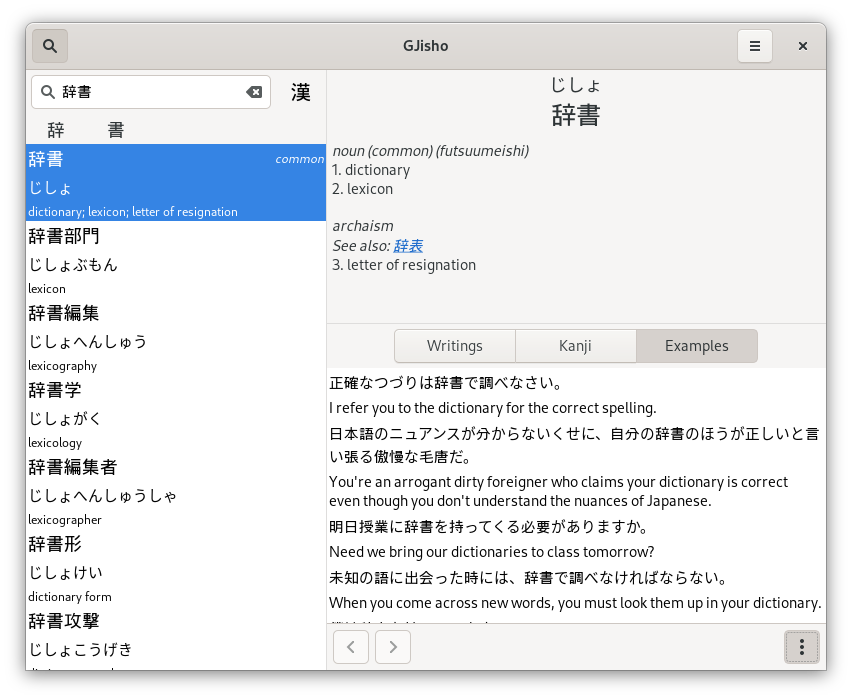
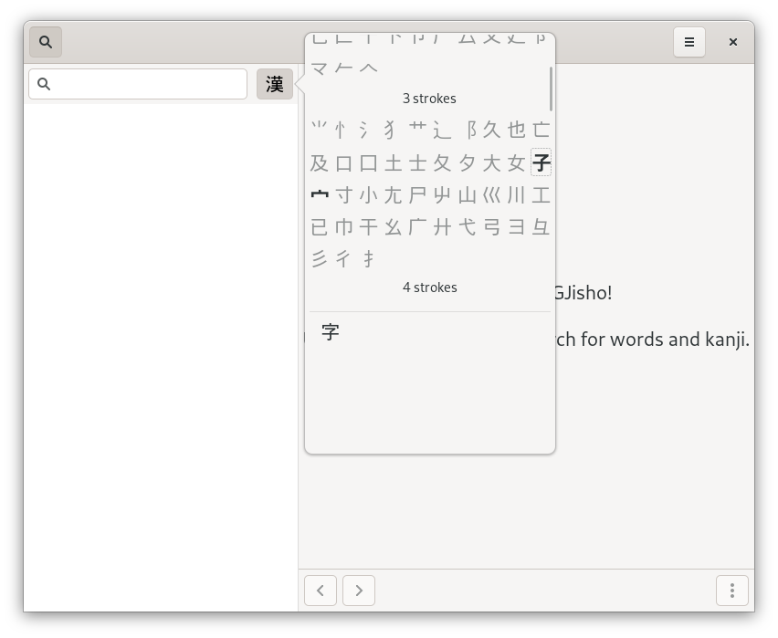

# GJisho

GJisho is a Japanese-English dictionary for GNOME.

## Building and installing

GJisho is written in [Go](https://golang.org/), so Go must be installed to build
it. It also requires the GTK3 development libraries, which will vary based on
distribution.

To fetch the resource files needed for the dictionary, run `make fetch` or
download them manually (see below). Then, run `make` to build the application
and the database, followed by `make install` to install them (`make install` may
need to be run as `sudo make install` or similar).

### Prerequisite resources

These resources can be downloaded manually and placed into the correct locations
(see the makefile) as an alternative to running `make fetch`.

- JMDict: <https://www.edrdg.org/wiki/index.php/JMdict-EDICT_Dictionary_Project>
  - Download: <http://ftp.monash.edu/pub/nihongo/JMdict.gz>
- KANJIDIC: <https://www.edrdg.org/wiki/index.php/KANJIDIC_Project>
  - Download: <http://www.edrdg.org/kanjidic/kanjidic2.xml.gz>
- KRADFILE: <https://www.edrdg.org/krad/kradinf.html>
  - Download: <ftp://ftp.monash.edu/pub/nihongo/kradfile.gz>
  - Note: this file is encoded in EUC-JP and must be converted to UTF-8 before
    building the database
- Tatoeba/Tanaka Corpus: <https://www.edrdg.org/wiki/index.php/Tanaka_Corpus>
  - Download: <ftp://ftp.monash.edu/pub/nihongo/examples.utf.gz>
- KanjiVG: <https://github.com/KanjiVG/kanjivg>
  - Download: <https://github.com/KanjiVG/kanjivg/releases/download/r20160426/kanjivg-20160426.xml.gz>

## Screenshots

